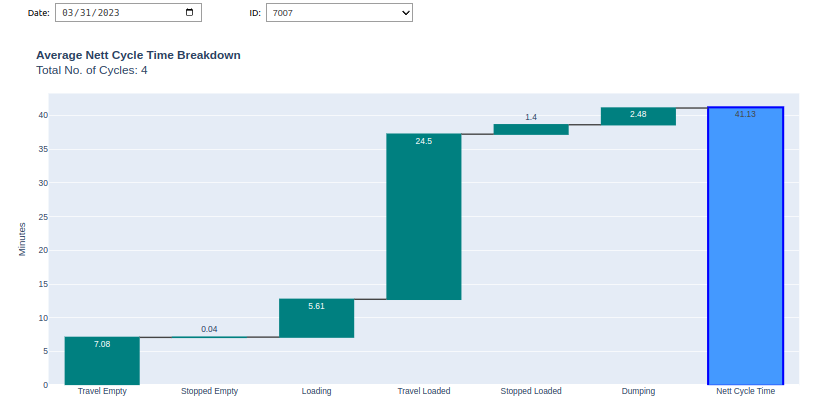
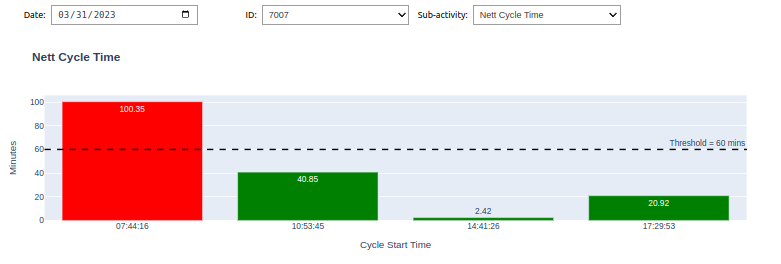

# Interactive Plots Using Plotly

## Description
This project provides examples of how to create interactive plots using plotly and ipywidgets using data from moving assets. The data collection process is also included.

Examples are provided in plotly.ipynb:





## Prerequisites
Python version: 3.11.9
```bash
# Install dependencies
pip install -r requirements.txt